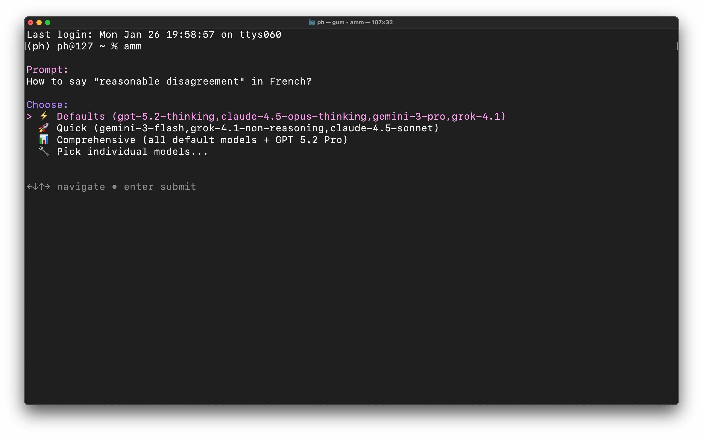
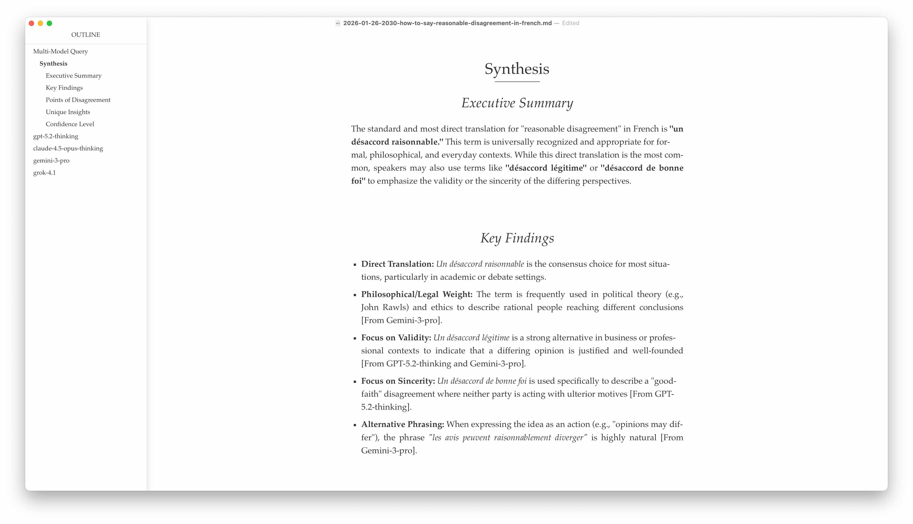

# Ask Many Models

A Claude Code skill for querying multiple AI models (GPT, Claude, Gemini, Grok) in parallel and synthesising their responses.

## Usage

**Within Claude Code:** Just say "Ask many models: [your question]" and Claude will handle the rest.

**From the command line:** Type `amm` and press enter.

## Documentation

See [SKILL.md](./SKILL.md) for complete documentation and usage instructions.

## Installation

Paste this repository URL into Claude Code and ask Claude to install it.

## About

Created by [Peter Hartree](https://x.com/peterhartree). For updates, follow [AI Wow](https://wow.pjh.is), my AI uplift newsletter.

Find more skills at [HartreeWorks/skills](https://github.com/HartreeWorks/skills).
