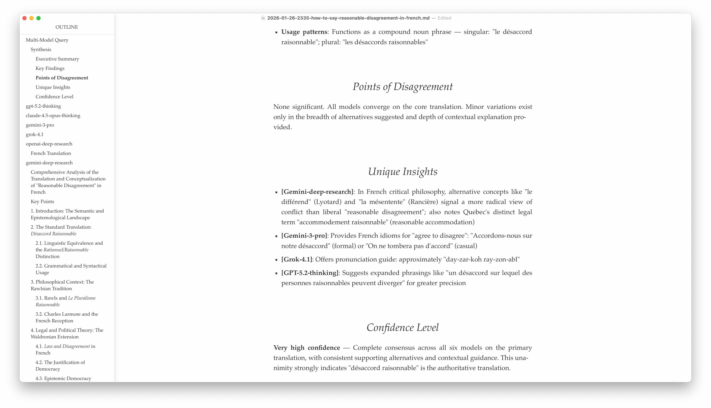

# Ask Many Models

A Claude Code skill for querying multiple AI models (GPT, Claude, Gemini, Grok) in parallel and synthesising their responses. Includes deep research support.




## Usage

**Within Claude Code:** Just say "Ask many models: [your question]" and Claude will handle the rest.

**From the command line:** Type `amm` and press enter.

**Discussion workflow:** See below.

## Discussion workflow

For complex tasks, the best way to use this skill is to:

1. **Have a normal discussion first.** Talk through your task in Claude Code, as if you were only planning to consult Claude. Explore project context, share relevant files, go back and forth.

2. **Then, tell Claude you want to ask many models, and draft a comprehensive prompt together.** Have Claude help you write the prompt you’ll send to the other models. The prompt should capture key stuff from your discussion so far, and include substantive additional context if necessary.

3. **Query multiple models.** Send the prompt to get diverse perspectives that may challenge your framing or identify blind spots.

**Why this works well:**

- The initial discussion surfaces insights and context that would be hard to include in a cold prompt
- Claude can structure the prompt to be clear and comprehensive for other models
- The other models receive a much richer prompt than you'd typically write from scratch

**Example flow:**

```
You: [Share context files, explain the situation, discuss for 1-20 minutes]

You: "I'd like to get perspectives from other models on this. Can you draft a prompt that captures our discussion, all the key context info, and asks the key questions?"

Claude: [Drafts comprehensive prompt, saves to file]

You: "Let's ask many models"

Claude: [Runs the query with the drafted prompt]
```

## Documentation

See [SKILL.md](./SKILL.md) for complete documentation and usage instructions.

## Installation

```bash
# Run install
npx skills add HartreeWorks/skill--ask-many-models

# When asked "Which agents do you want to install to?", select "Claude Code"
# in addition to the default "Universal" list.
```

If you get "command not found", [install Node](https://github.com/HartreeWorks/skills/blob/main/how-to-install-node.md) then try again.

## About

Created by [Peter Hartree](https://x.com/peterhartree). For updates, follow [AI Wow](https://wow.pjh.is), my AI uplift newsletter.

Find more skills at [skills.sh](https://skills.sh) and [HartreeWorks/skills](https://github.com/HartreeWorks/skills).
